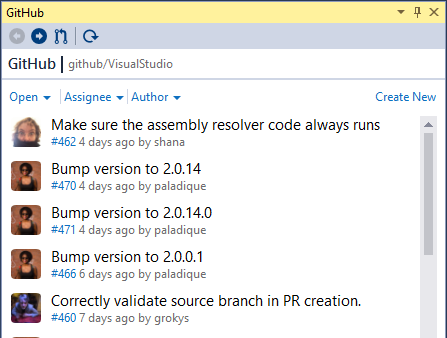
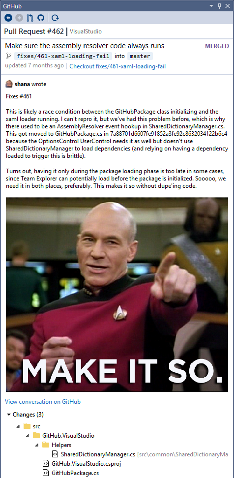
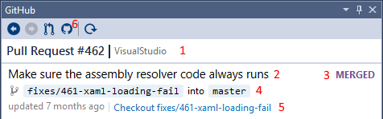
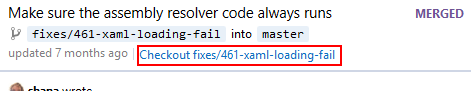

# Reviewing Pull Requests

When you have a project loaded, you can view the pull requests for the project by opening the GitHub pane:

- Go to Team Explorer Home and click "Pull Requests"
- Type "GitHub" into the Visual Studio Quick Launch bar and select "View -> Other Windows -> GitHub"
- Open the pane from the View -> Other Windows -> GitHub menu

The pane should be automatically populated with the Pull Requests for the current project:

Clicking on one of the pull requests will bring up the details for that Pull Request:

In this view, you can see the general details about the Pull Request, as well as the Pull Request description and the files changed.

## General Pull Request Details

1. The Pull Request number and project
2. The Pull Request title
3. The Pull Request state
4. The Pull Request source and target branch. If the pull request is from a fork then the source branch will be labelled with the fork, e.g. `fork:fixes/461-xaml-loading-fail`
5. A link which can be used to to [checkout the Pull Request](#checking-out-a-pull-request)
6. Opens the pull request on GitHub

## Files Changed

The files changed by the pull request are listed in a tree:

You can double-click a file in the tree to get a diff of the state of the file in the source branch with the file in the target branch. If the Pull Request branch is currently checked out, you can also open the file in the working directory by right-clicking and selecting "Open File".

## Checking out a Pull Request

You can check out the Pull Request branch by clicking the "Checkout" link:

This will check out the source branch of the Pull Request.

> Note that a pull request branch cannot be checked out if your working directory has changes, so either stash, undo or commit your changes.
>

If the Pull Request comes from a fork, then a remote will be added to the fork, and the Pull Request checked out using this remote. The remote will be automatically tidied up once the local Pull Request branch is deleted.
