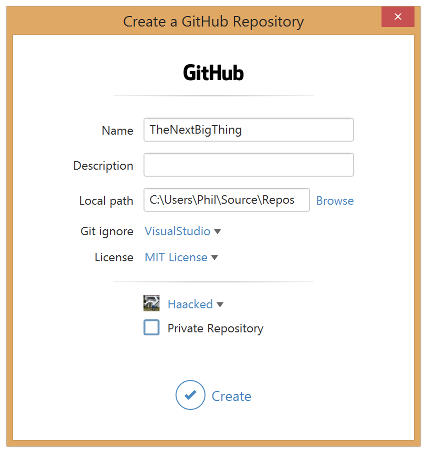
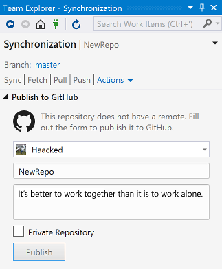
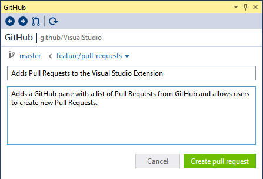
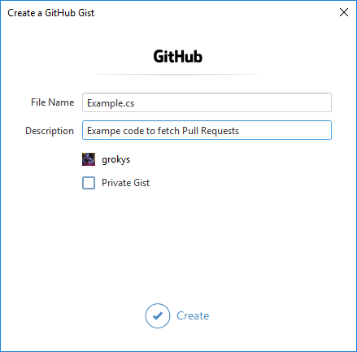

# Welcome to GitHub for Visual Studio

GitHub for Visual Studio is the easiest way to connect to your GitHub repositories in Visual Studio.

# Features

## Connect to GitHub

GitHub for Visual Studio integrates into Team Explorer to allow you to [sign in to GitHub and GitHub enterprise instances](connect.md) with full support for two-factor authentication. There is no need to use personal API tokens.

## Clone Repositories in one click

Once connected, it's quick to [clone repositories](clone.md) from your account or any organization you belong to.

Click the clone button to bring up a dialog that shows all the repositories you have access to. Use the filter textbox to quickly find the repository you're interested in.

## Create repositories and build something great

Need a new repository on GitHub? No problem! The create dialog makes it easy to [create a repository on GitHub and clone it to Visual Studio](create.md) all in one step.

## Publish your local work to GitHub

Already have a project on your machine? Well what are you waiting for? Publish it to GitHub and start collaborating with others.

In the Team Explorer window, click on the Sync tab to get to the Publish to GitHub dialog.

## Review Pull Requests in Visual Studio

Tired of switching between Visual Studio and GitHub to review Pull Requests? You can [review Pull Requests ](pr-review.md) directly from Visual Studio.

## Create Pull Requests from Visual Studio

You don't need to got to GitHub to create a Pull Request - [turn a branch into a Pull Request directly from Visual Studio](pr-create.md).

## Create Gists

[Create gists](gists.md) and upload them to GitHub directly from Visual Studio.

Simply select the code to upload and select Create Gist from the GitHub context menu.